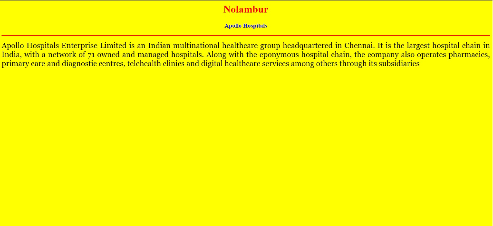
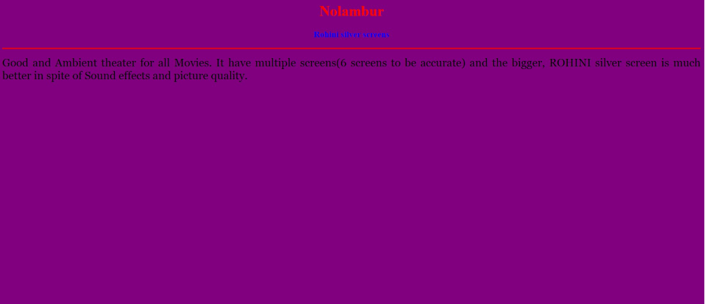
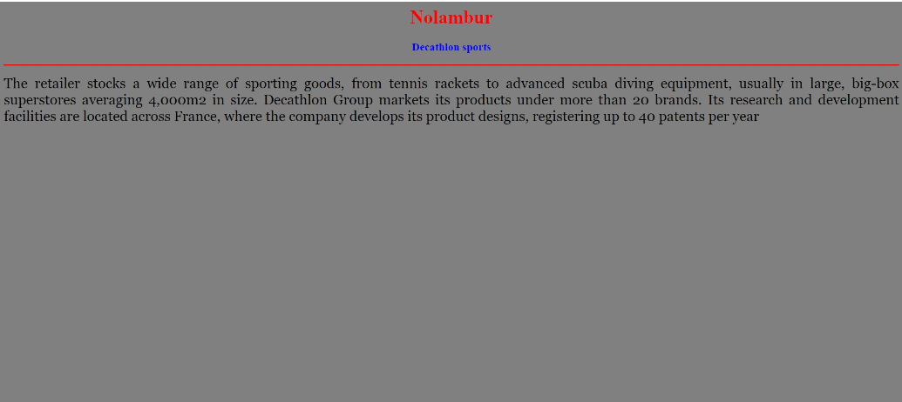
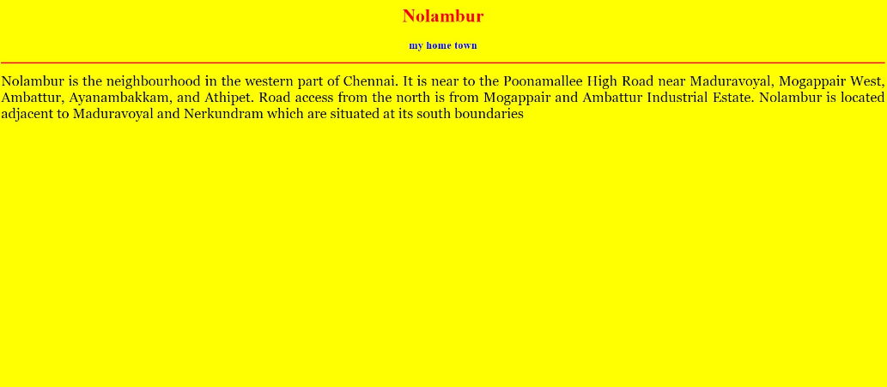
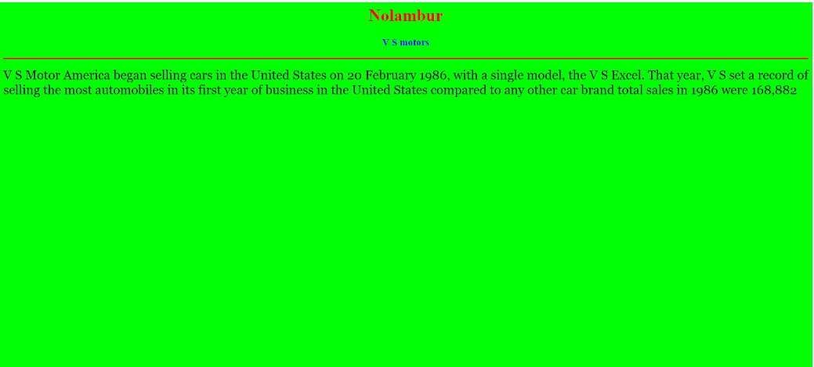

# Places Around Me
## AIM:
To develop a website to display details about the places around my house.

## Design Steps:

### Step 1
Create a new Django project

### Step 2
download your city map from google

### Step 3
using tag name the map

### Step 4
create click table regions in the image using tag

### Step 5
write HTML programs for all the reggations identified

### Step 6
execute the program and publish them

## Code:

```
map.html

<html>
<head>
<title>My City</title>
</head>
<body>
<h1 align="center">
<font color="red"><b>Nolambur</b></font>
</h1>
<h3 align="center">
<font color="blue"><b>Sai Darshini R S(23007938)</b></font>
</h3>
<center>

<map name="MyCity">
<area shape="rect" coords="700,300,900,900" href="home.html" title="My Home Town">
<area shape="circle" coords="570,230,45" href="hospital.html" title="Apollo hospitals">
<area shape="circle" coords="640,300,50" href="sports.html" title="decathlon sports">
<area shape="circle" coords="100,100,900,900" href="motors.html" title="V S motors">
<area shape="rect" coords="950, 120, 1100,140" href="theatre.html" title="Rohini Silver Screens">
</map>
</center>
</body>
</html>

home.html

<html>
<head>
<title>My Home Town</title>
</head>
<body bgcolor="yellow">
<h1 align="center"> 
<font color="red"><b>Nolambur</b></font>
</h1>
<h3 align="center">
<font color="blue"><b>my home town</b></font>
</h3>
<hr size="3" color="red">
<p align="justify">
</html>
<font face="Georgia" size="5">
Nolambur is the neighbourhood in the western part of Chennai.
It is near to the Poonamallee High Road near Maduravoyal, Mogappair West, Ambattur, Ayanambakkam, and Athipet.
Road access from the north is from Mogappair and Ambattur Industrial Estate. Nolambur is located adjacent to Maduravoyal and Nerkundram
which are situated at its south boundaries</font>
</p>
</body>
</html>

hospitals.html

<html>
<head>
<title>My Home Town</title>
</head>
<body bgcolor="yellow">
<h1 align="center"> 
<font color="red"><b>Nolambur</b></font>
</h1>
<h3 align="center">
<font color="blue"><b>Apollo Hospitals</b></font>
</h3>
<hr size="3" color="red">
<p align="justify">
</html>
<font face="Georgia" size="5">
Apollo Hospitals Enterprise Limited is an Indian multinational healthcare group headquartered in Chennai.
It is the largest hospital chain in India, with a network of 71 owned and managed hospitals. 
Along with the eponymous hospital chain, the company also operates pharmacies, primary care and diagnostic centres, telehealth clinics 
and digital healthcare services among others through its subsidiaries</font>
</p>
</body>
</html

motors.html

<html>
<head>
<title>My Home Town</title>
</head> 
<body bgcolor="lime">
<h1 align="center"> 
<font color="red"><b>Nolambur</b></font> 
</h1> 
<h3 align="center"> 
<font color="blue"><b>V S motors</b></font>    
</h3>
<hr size="3" color="red">
<p align="justify">
<font face="Georgia" size="5">
V S Motor America began selling cars in the United States on 20 February 1986, with a single model, the V S Excel. 
That year, V S set a record of selling the most automobiles in its first year of business in the United States compared to any other car brand 
total sales in 1986 were 168,882</font>
</p>
</body>
</html>

sports.html

<head>
<title>My Home Town</title>
</head>
<body bgcolor="grey">
<h1 align="center"> 
<font color="red"><b>Nolambur</b></font>
</h1>
<h3 align="center">
<font color="blue"><b>Decathlon sports</b></font>
</h3>
<hr size="3" color="red">
<p align="justify">
</html>
<font face="Georgia" size="5">
The retailer stocks a wide range of sporting goods, from tennis rackets to advanced scuba diving equipment, 
usually in large, big-box superstores averaging 4,000m2 in size.
Decathlon Group markets its products under more than 20 brands. 
Its research and development facilities are located across France, 
where the company develops its product designs, registering up to 40 patents per year</font>
</p>
</body>
</html>

theartre.html

<head>
<title>My Home Town</title>
</head>
<body bgcolor="purple">
<h1 align="center"> 
<font color="red"><b>Nolambur</b></font>
</h1>
<h3 align="center">
<font color="blue"><b>Rohini silver screens</b></font>
</h3>
<hr size="3" color="red">
<p align="justify">
</html>
<font face="Georgia" size="5">
Good and Ambient theater for all Movies. 
It have multiple screens(6 screens to be accurate) and the bigger, 
ROHINI silver screen is much better in spite of Sound effects and picture quality.</font>
</p>
</body>
</html>

```

## Output:











## Result:
The program implementing image maps using HTML is executed successfully.
